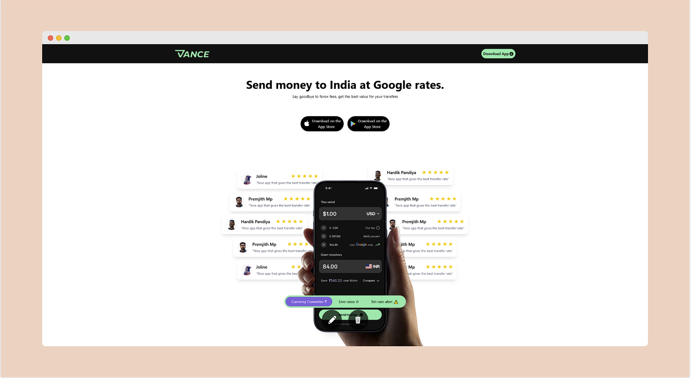
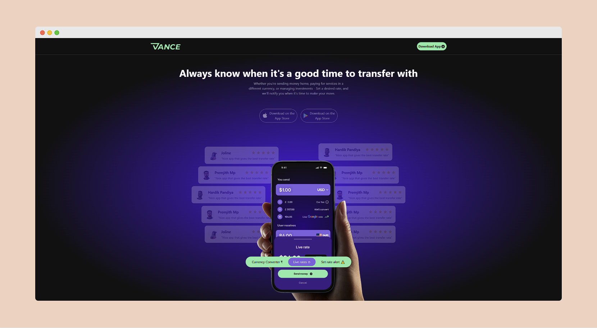
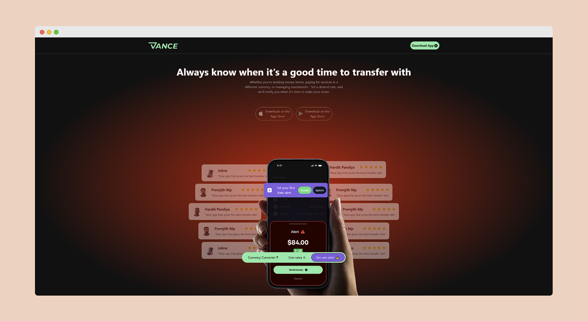
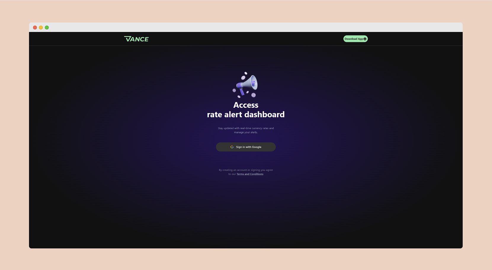
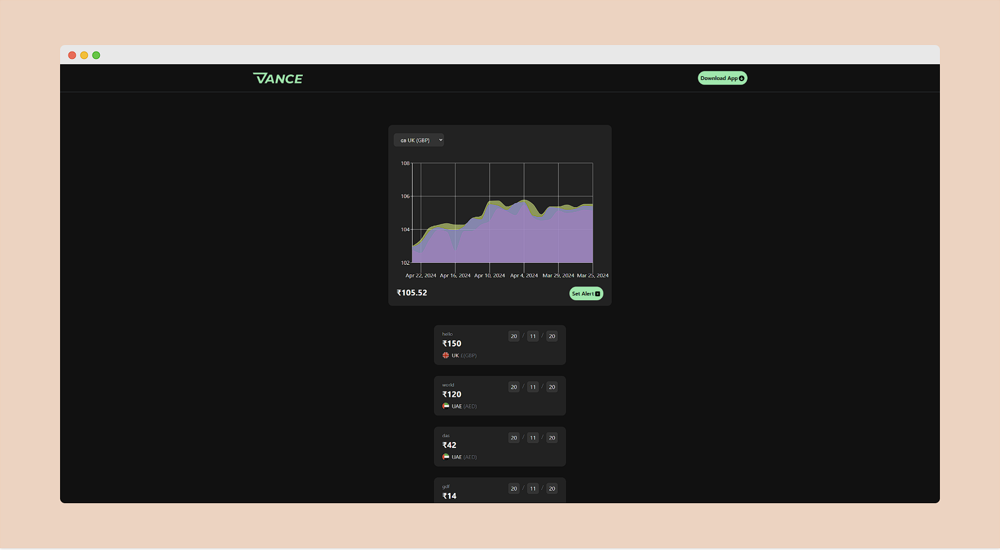
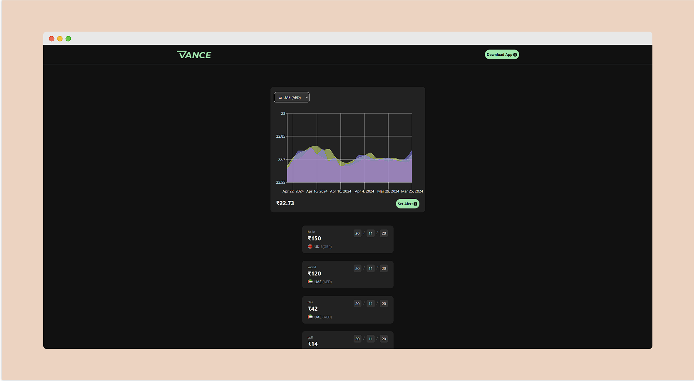
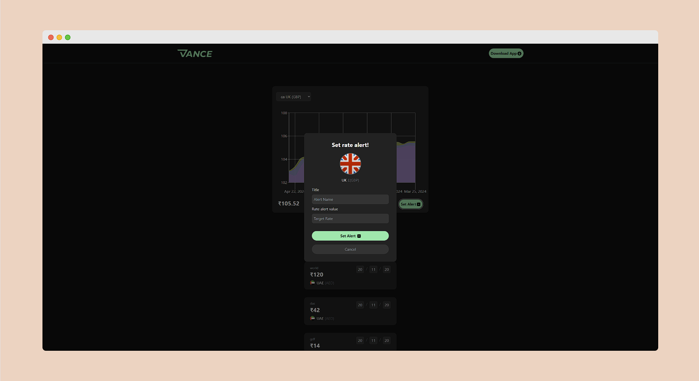

## Deployment Link(Vercel):  https://vance-parallax-effect.vercel.app/

## Codebase Link(Github): https://github.com/Surya-bbas/vance-parallax-effect

## All Dependencies and libraries used: 

- React.js
- Firebase
- Recharts
- Motion
- Tailwind CSS
- React Icons
- React Router DOM
- Axios

## Application sections:

- Landing page
- App

### Landing page preview:

### App preview:

    Note: All non-functional buttons change your route 